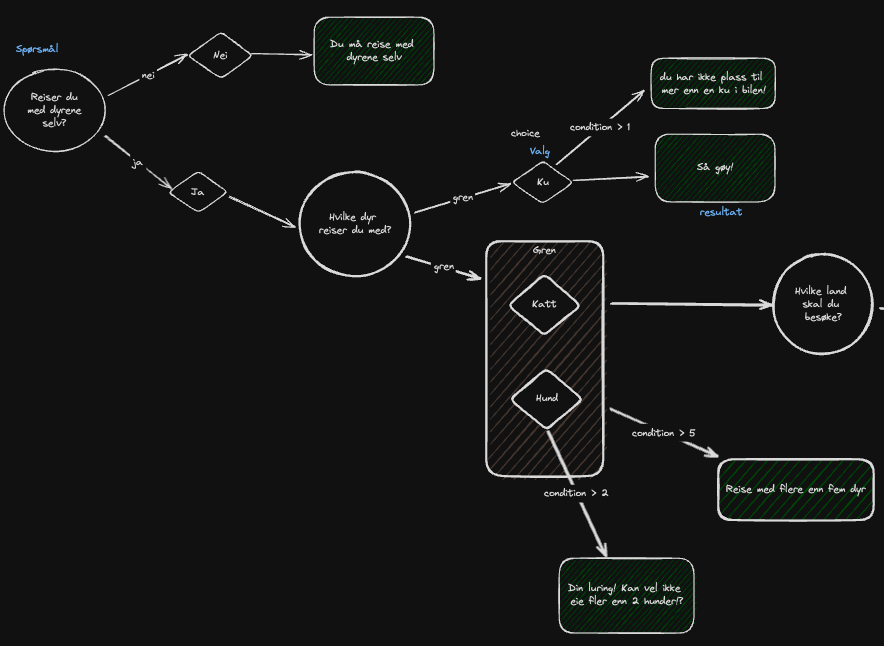
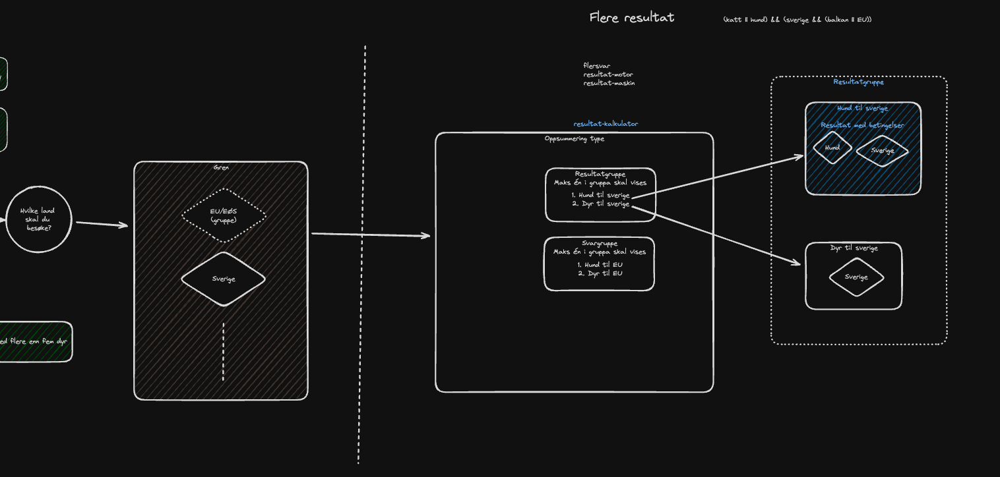

# Mattilsynet's headless wizard for enonic xp
* [Setup](#setup)
* [Implementation](#Implementation)
  * [Make the wizard lightning fast](#Make-the-wizard-lightning-fast)
  * [GraphQL query](#GraphQL)
  * [Example pseudocode in svelte](#Example-pseudocode-in-svelte)
* [Developer documentation](#Developer-documentation)
  * [Terminology](#Terminology)
  * [Structure](#Structure)
    * [Single result wizard](#Single-result-wizard)
    * [Multiple result wizard](#Multiple-result-wizard)

## Setup
* Install the app from enonic market
* Add the app to a site
* Get started by either:
  * Seeing the [editor documentation](doc/editor-doc.pdf). This is currently a dump of our internal confluence documentation for editors, so it's a bit messy with "broken" links and such.
  * Importing the [example wizard](doc/wizard-example.zip) to your xp instance
    * The example is close to what we use on our linear [Guide: Travelling with pets to Norway](https://www.mattilsynet.no/dyr/kjaeledyr/reise-med-kjaeledyr/veiviser-reise-med-kjaeledyr)
    * Other live examples:
      * [Sjekk hvilke materialer du kan bruke til fôr og gjødsel](https://www.mattilsynet.no/veiviser-for-og-gjodsel)
  * Trying it out blindly

## Implementation
### Make the wizard lightning fast
[](https://badge.fury.io/js/@mattilsynet%2Fveiviser)
#### Intall the helper npm package in your frontend and run the `traverseGraph` function on the client.
This package also exposes some functions and types that should come in handy when implementing the frontend.

---

#### GraphQL
```graphql
fragment wizard on no_mattilsynet_wizard_Wizard {
  data {
    title
    intro {
      ...richTextFields
    }
    text {
      ...richTextFields
    }
    root(wizardChoices: $wizardChoices) {
      rootNode
      nodes
      edges
      choices
      validTree
      errors
      validationErrors {
        key
        message
      }
      traversedGraph
    }
  }
}
```
where wizardChoices is the choices made by the user so far as a URL search string (?UID1=value1&UID2=value2).

---

#### Example pseudocode in svelte

```sveltehtml
<script lang="ts">
  import {
    isMultiSelect,
    isNumbers,
    isRadioButton,
    isResult,
    isResultCalculator,
    traverseGraph,
    type WizardRoot
  } from '@mattilsynet/veiviser'
  import { type Content } from '$lib/types/enonic'

  export let { root }: Content & { root: WizardRoot } = getFromStoreIfExist() ?? fetch('graphql')

  // traverseGraph is only needed if you want to traverse on client side.
  // The server will also run the function and is available in root.traversedGraph
  $: {
    renderSteps,
    resultCalculatorNode
  } = traverseGraph($page.url.search, root)

  $: errors = root.validationErrors
</script>

{#if resultCalculatorNode}
  <ResultCalculator {resultCalculatorNode} />
{:else}
  <form>
    {#each renderSteps as step}
      {#if isRadioButton(step)}
        <WizardRadio {step} />
      {:else if isNumbers(step)}
        <WizardNumber {step} {values} {errors} />
      {:else if isMultiSelect(step)}
        <WizardMultiselect {step} {values} {errors} {loadJs} {nextButtonText} />
      {:else if isResult(step)}
        {#if step.conditionResults?.length > 0}
          {#each step.conditionResults as result, i}
            <h2>{result.title}</h2>
            <div>
              {@html result.text}
            </div>
          {/each}
        {:else}
          <h2>{step.title}</h2>
          <div>
            {@html step.text}
          </div>
        {/if}
      {:else if isResultCalculator(step)}
        <WizardSummary>
          <input type="hidden" name={step.id} value="true" />
          <button type="submit">
            Til oppsummering
          </button>
        </WizardSummary>
      {/if}
    {/each}
  </form>
{/if}
```

## Developer documentation
### General
If you want to re-use choices in multiple wizards, you can create choices and choice-groups in a folder named "veiviser-valg".
### Terminology
We have used principles from both Graph Theory and Tree Data Structures to produce the wizard.
The naming is therefore a bit mixed with both graph and tree terminology.

### Structure
#### Single result wizard
The creation of a wizard defaults to the simplest version of a wizard.
This wizard can be visualized by a simple tree structure where each node has a parent and possibly children.

The nodes can either be a question or result.

The edges between the nodes consists of target nodes and the choice(s) that the user must fulfill to reach the target node.

The following image is a illustration of a simple wizard with only single results.


---

#### Multiple result wizard
The wizard can also have multiple results.

This is achieved by adding a result-calculator node. This requires the use of the choice content-type and optionally the choice-group content-type. The choices should be referenced in the branches (edges), such that the result-calculator can calculate the result based on the choices made by the user.

* The result-calculator can contain multiple result-groups
* Result groups can contain multiple result-with-conditions and "normal results"
  * There can be 0 or 1 actual results for each result-group
  * The uppermost satisfied result in a result-group will be the result shown to the user.
  * A "normal result" in a result-group will always be shown if none of the results-with-conditions are satisfied above.
* Result-with-conditions contains criteria that must be satisfied to show the result
  * The criteria is based on choices made by the user, and can either reference a single choice or a choice-group.
  * The criteria is built using a "boolean builder" where the editor can choose to use AND, OR, or NOT to combine multiple criteria. These can be nested to create complex conditions.

The following illustration shows the rest of the image above, which includes a result-calculator content-type.

